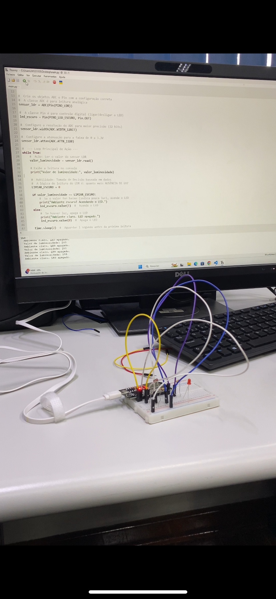
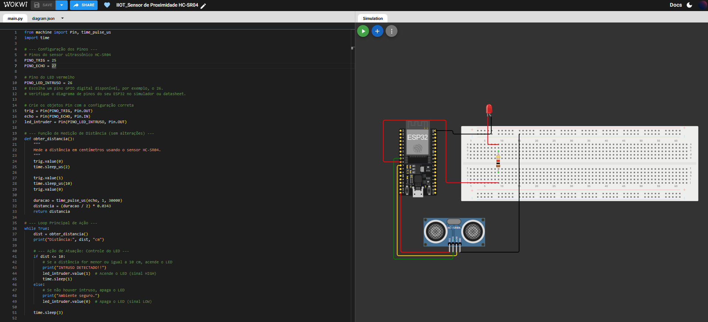
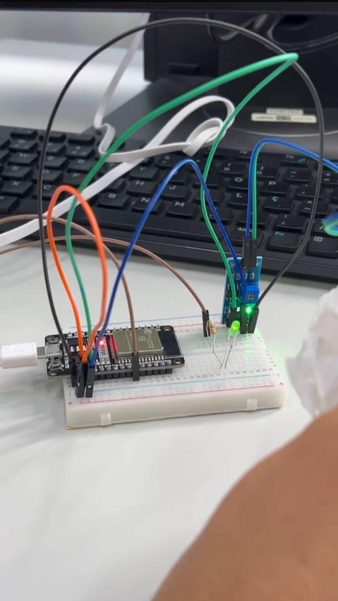

# IOT---SENSORES

---

---

---

### Sobre

# 🌡️ IoT - Sensores ESP32

> Projeto prático de IoT utilizando ESP32 com MicroPython para monitoramento de sensores diversos.

## 📋 Descrição

Este projeto tem como objetivo colocar em prática os conhecimentos adquiridos em IoT, desenvolvendo um sistema de monitoramento inteligente utilizando ESP32 programado em MicroPython. O sistema coleta dados de sensores ambientais e os transmite para plataformas de monitoramento, permitindo análise e controle remoto de forma simples e eficiente.

## 📑 Índice

- [Instalação](#instalação)
- [Uso](#uso)
- [Funcionalidades](#funcionalidades)
- [Configuração](#configuração)
- [Dependências](#dependências)
- [Contato](#contato)
- [Créditos](#créditos)

---

### Pré-requisitos

- ESP32 (qualquer modelo compatível)
- Python 3.7+ instalado no computador
- Thonny IDE ou similar para MicroPython
- Sensores compatíveis (DHT22, LDR, etc.)

---

### Hardware
- **ESP32** (qualquer modelo: WROOM, WROVER, etc.)
- **Sensor DHT22** - Temperatura e umidade
- **Sensor LDR** - Luminosidade
- **Sensor PIR HC-SR501** - Movimento (opcional)
- **Resistores:** 10kΩ (pull-up), 1kΩ (divisor tensão)
- **LED** - Indicador de status
- **Protoboard** e jumpers

---

### Ferramenta de Desenvolvimento
- **Thonny IDE** - Editor recomendado